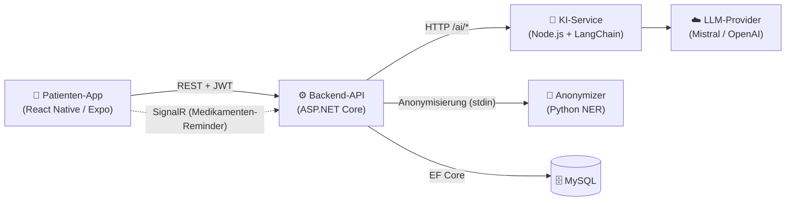
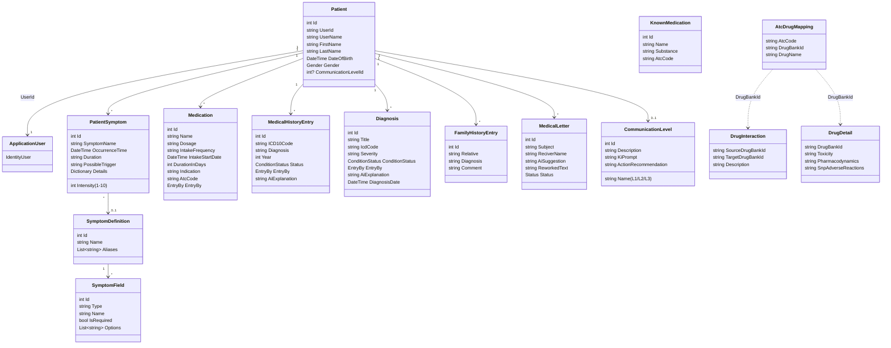
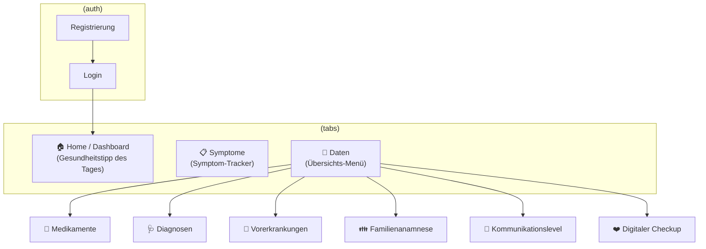

# ADAM – Projektdokumentation

> **Innovationsprojekt „Fehldiagnosen"** · Teamprojekt (5 Personen)
> ADAM ist ein Tool zur Verwaltung medizinischer Daten. Patient:innen pflegen ihre
> Symptome, Medikamente, Vorerkrankungen, Diagnosen und Familienanamnese; eine KI
> erklärt Diagnosen verständlich – abgestimmt auf das individuelle Vorwissen
> (Kommunikationslevel) – und fasst den Gesundheitsstand als „digitalen Checkup"
> zusammen. Ziel ist es, Informationslücken zwischen Patient:in und Arzt zu schließen
> und so Fehldiagnosen vorzubeugen.

---

## 1. Systemüberblick

ADAM besteht aus folgenden Bausteinen:

| Baustein | Technologie | Aufgabe |
|----------|-------------|---------|
| **Patienten-App** | React Native + Expo (TypeScript) | Mobile Oberfläche für Patient:innen |
| **Backend-API** | ASP.NET Core (.NET, Clean Architecture) | Geschäftslogik, Persistenz, Auth |
| **KI-Service** | Node.js / Express + LangChain | Diagnose-Erklärung, Checkup-Zusammenfassung, Arztbrief-Interpretation |
| **Anonymisierung** | Python (NER: Presidio + spaCy) | Personenbezogene Daten vor dem LLM-Aufruf entfernen |
| **Datenbank** | MySQL (EF Core) | Persistente Speicherung aller Daten |

**Backend-Schichtung (Clean Architecture):**
`Api` (Controller) → `Application` (Services, DTOs, Interfaces) → `Domain` (Entities, Enums) ← `Infrastructure` (EF-Core-Repositories, SignalR-Hub). Die Abhängigkeiten zeigen nach innen auf die `Domain`; Repositories werden über Interfaces (`Application/Repositories`) entkoppelt und per Dependency Injection in `Program.cs` registriert.

**Wissensbasis des KI-Dienstes:** Zusätzlich nutzt der KI-Dienst eine kuratierte ICD-10-Wissensbasis aus Markdown-Dateien (`AI/knowledge/*.md`, kein Teil der Datenbank), die als fachlicher Kontext für die Diagnoseerklärung dient.

---

## 2. Domain Model

Zentrale Entität ist der **Patient**. Alle medizinischen Datensätze hängen über `PatientId` an ihm. Authentifizierung läuft über ASP.NET Identity (`ApplicationUser`), das per `UserId` mit dem Patienten verknüpft ist.

### Entitäten im Überblick

| Entität | Zweck | Wichtige Felder |
|---------|-------|-----------------|
| **Patient** | Stammdatensatz, Aggregat-Wurzel | Name, Geburtsdatum, Gender, CommunicationLevel |
| **ApplicationUser** | Identity-Login (JWT) | von `IdentityUser` abgeleitet |
| **PatientSymptom** | Tägliche Beschwerden | Intensität (1–10), Dauer, Trigger, freie `Details` |
| **SymptomDefinition / SymptomField** | Vorlagen + dynamische Felder für Symptomerfassung | Aliases, Feldtyp, Pflichtfeld, Optionen |
| **Medication** | Medikation des Patienten | Dosierung, Häufigkeit, Dauer (→ berechnetes `EndDate`), ATC-Code |
| **MedicalHistoryEntry** | Vorerkrankungen | ICD-10, Diagnose, Jahr, Status, KI-Erklärung |
| **Diagnosis** | Detaillierte Diagnose (Arzt/Patient) | ICD, Schweregrad, Symptome, Befund, Therapie, KI-Erklärung |
| **FamilyHistoryEntry** | Familienanamnese | Verwandtschaftsgrad, Diagnose, Kommentar |
| **MedicalLetter** | Arztbrief (KI-Entwurf/-Interpretation + Überarbeitung) | Betreff, Empfänger, Status (Validation/Confirmed) |
| **CommunicationLevel** | Vorwissen-Level steuert KI-Prompt | Name (L1/L2/L3), KiPrompt, Handlungsempfehlung |
| **KnownMedication** | Referenzliste für Autocomplete | Name, Substanz, ATC-Code |
| **AtcDrugMapping** | Brücke ATC-Code → DrugBank-ID | AtcCode, DrugBankId, DrugName |
| **DrugInteraction** | Wechselwirkungen zwischen Wirkstoffen | Source-/TargetDrugBankId, Beschreibung |
| **DrugDetail** | Pharmakologische Detaildaten | Toxizität, Pharmakodynamik, SNP-Nebenwirkungen |

### Enums
- **ConditionStatus**: `Chronical`, `Active`, `InRemission`
- **EntryBy**: `Patient`, `Doctor` (wer den Eintrag erfasst hat)
- **Gender**: `Male`, `Female`, `Other`
- **MedicalLetter.Status**: `Validation`, `Confirmed`

---

## 3. UI Screens (Patienten-App)

Navigation über Expo Router: ein **Auth-Stack** und ein **Tab-Layout** mit drei Haupt-Tabs; der Tab **Daten** ist ein Menü, das alle Detailbereiche per Push öffnet.

| Screen | Datei | Inhalt |
|--------|-------|--------|
| **Login** | `app/(auth)/login.tsx` | Anmeldung, JWT wird in SecureStore/localStorage abgelegt |
| **Registrierung** | `app/(auth)/register.tsx` | Neues Patientenkonto anlegen |
| **Home / Dashboard** | `app/(tabs)/index.tsx` | Begrüßung + „Gesundheitstipp des Tages" (KI) |
| **Symptom-Tracker** | `app/(tabs)/symptom.tsx` | Symptome nach Datum erfassen; Autocomplete über SymptomDefinitions |
| **Daten** | `app/(tabs)/data.tsx` | Menü zu allen Datenbereichen + Logout |
| **Medikamente** | `app/medications.tsx` | Medikation pflegen, Autocomplete, **Wechselwirkungs-Warnung**, **Foto-Upload (KI-Auslesung)** |
| **Diagnosen** | `app/diagnosis.tsx` | Diagnosen verwalten, KI-Erklärung, **Arztbrief hochladen → KI-Interpretation** |
| **Vorerkrankungen** | `app/medicalhistory.tsx` | Historie, KI-Erklärung einer Vorerkrankung |
| **Familienanamnese** | `app/familyhistory.tsx` | Erbliche Erkrankungen erfassen |
| **Kommunikationslevel** | `app/communicationlevel.tsx` | Fragebogen stellt persönliches Vorwissen-Level ein |
| **Digitaler Checkup** | `app/checkup.tsx` | KI-Zusammenfassung aller Gesundheitsdaten (Diagnosen, Medikamente, Symptome) |

**Wiederverwendbare Bausteine:** Card, DataList, Form-Inputs (Picker, Slider, DatePicker, DurationInput), PrimaryButton, HeaderView, ThemedView/ThemedText (Hell-/Dunkelmodus). Datenzugriff gekapselt in Hooks (`use-symptoms`, `use-medications`, `use-diagnosis`, `use-medication-scanner`, `use-patient` …) und API-Services (`src/api/*`).

---

## 4. Architectural Decision Records (ADRs)

Die ADRs folgen dem **Template nach Michael Nygard** (Titel · Status · Kontext inkl. Optionen · Entscheidung · Konsequenzen), wie in den LV-Folien vorgegeben. Vollständige Records siehe [`records-architecture-decisions.md`](records-architecture-decisions.md). Überblick (alle Status: `accepted`):

| Nr. | Entscheidung | Gewählt | Betrachtete Optionen | Kerngrund |
|-----|--------------|---------|----------------------|-----------|
| **ADR 01** | Frontend Patientenansicht (App) | **React Native + Expo** | Website, RN ohne Expo | Niedrige Einstiegshürde, Push-Reminder, Cross-Platform |
| **ADR 02** | Backend (später + Node für KI) | **ASP.NET Core, zusätzlich Node.js** | Node.js, Spring Boot, PHP, Python | Sicherheit/Performance; Node später ergänzt für reiferes LLM-Ökosystem |
| **ADR 03** | Datenbank | **MySQL** | PostgreSQL, MSSQL | ACID, Zuverlässigkeit, EF-Core-Integration, Kosten |
| **ADR 04** | Authentifizierung | **JWT + ASP.NET Identity** | Server-Sessions, externer IdP | Zustandslos, passend für mobile App |
| **ADR 05** | Backend-Struktur | **Clean Architecture + Repository** | direkter DbContext in Controllern | Testbarkeit, austauschbare Infrastruktur |
| **ADR 06** | Patientengerechte Diagnoseerklärung | **RAG-Light + Validator-Pipeline** | reiner Prompt, volle Vektor-RAG | Korrekt + laienverständlich, weniger Halluzination |
| **ADR 07** | Datenschutz bei LLM-Aufrufen | **Anonymisierung (Python-NER) vor Versand** | Klartext-Versand, lokales Modell | DSGVO: keine Klartext-Patientendaten an Dritte |
| **ADR 08** | Echtzeit-Reminder | **SignalR** | HTTP-Polling | Push in Echtzeit, weniger Last |
| **ADR 09** | Automatisierte Datenzusammenfassung (Checkup) | **KI-Zusammenfassung aggregierter Daten** | – | Gesamtbild + Zusammenhänge, Vorbereitung aufs Arztgespräch |

> Volle Records (mit Status, Kontext, Entscheidung, Konsequenzen) im verlinkten ADR-Dokument.

### KI-Endpunkte (Node.js-Service, Port 3000)

| Endpoint | Zweck |
|----------|-------|
| `POST /ai/explain` | Diagnose/Vorerkrankung patientengerecht erklären (RAG + Validator) |
| `POST /ai/checkup-summary` | Gesundheitsdaten zu einer lesbaren Zusammenfassung verdichten |
| `POST /ai/interpret-medical-letter` | Hochgeladenen Arztbrief in strukturierte Daten/Erklärung übersetzen |

---

## 5. Reflexion & Team-Entscheidungen

### Arbeitsweise im Team (5 Personen)
- **Striktes Kanban-Board** (GitHub Projects): `Ready → In progress → In review → Done`.
- **Feature-Branch-Workflow** – niemand pusht direkt auf `main`.
- **Pull Requests mit Vier-Augen-Prinzip**: jeder PR wird von einem anderen Teammitglied reviewt und erst nach „Approve" gemmerged.
- Issues werden über `Closes #x` automatisch geschlossen.

Die Git-Historie bestätigt diesen Workflow durchgängig (Feature-Branches + Merge-PRs, je Issue ein Branch, z. B. `45-digitaler-checkup`, `44-hochladen-eines-medikaments-als-bild`, `46-medikamentenwechselwirkung`).

### Inhaltliche Reflexion
- **Patient als Aggregat-Wurzel** hat sich bewährt: alle medizinischen Daten hängen klar an einem Patienten, Zugriffsrechte werden zentral über `UserId` geprüft.
- **Trennung KI-Service vom Backend** war richtig – das KI-Modul konnte unabhängig (RAG, Validator, Provider-Wechsel, Checkup, Arztbrief-Interpretation) weiterentwickelt werden.
- **Kommunikationslevel als eigene Entität** ermöglicht es, KI-Erklärungen wirklich an das Vorwissen anzupassen, statt nur einen festen Prompt zu nutzen – Kern des „Fehldiagnosen"-Gedankens (Verständnis auf Augenhöhe).
- **Datenschutz ernst genommen** – die nachträglich eingezogene Anonymisierungs-Stufe (Python-NER) vor jedem externen LLM-Aufruf zeigt das Bewusstsein für den sensiblen Datentyp.
- **Iterative Weiterentwicklung** sichtbar an der Diagnose-Entität: vom einfachen `MedicalHistoryEntry` mit String-Status hin zu typisiertem `ConditionStatus`/`EntryBy`, integrierter `AiExplanation` und KI-gestützter Auslesung von Bild-/Brief-Uploads.
- **Dosierung** wurde nachträglich in Menge + Einheit getrennt und mit Validierung/Auto-Befüllung versehen – Beispiel für nutzergetriebene Verfeinerung.
- **Digitaler Checkup** bündelt verstreute Einzeldaten zu einer verständlichen Gesamtsicht – der konkrete Mehrwert für Patient:innen.

### Offene Punkte / Ausblick
- Eine separate **Ärzteansicht** (Web/React) ist geplant, aber noch nicht umgesetzt – aktuell existiert nur die Patienten-App.
- Wechselwirkungs- und Referenzdaten (`KnownMedication`, `DrugInteraction`, `DrugDetail`) basieren auf importierten CSVs; Datenpflege/-aktualisierung wäre zu klären.
- Der Anonymizer setzt Python (Presidio/spaCy) auf dem Host voraus – Deployment-/Setup-Anforderungen dokumentieren.
- Die gelockerte Passwort-Policy (ADR 04) muss vor produktivem Einsatz verschärft werden.

---

*Stand: 18.06.2026 · erstellt auf Basis eines vollständigen Code-Screenings (Backend, Frontend, KI-Service, Anonymizer/OCR, ADRs, Git-Historie) – aktualisiert nach `git pull` (inkl. Digitaler Checkup, Diagnose-Screen, OCR-Scan, Arztbrief-Interpretation).*
