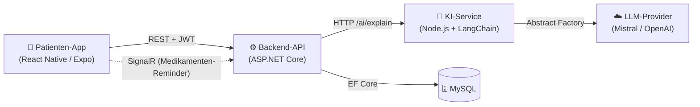
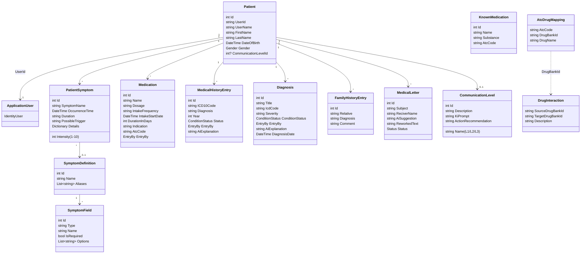
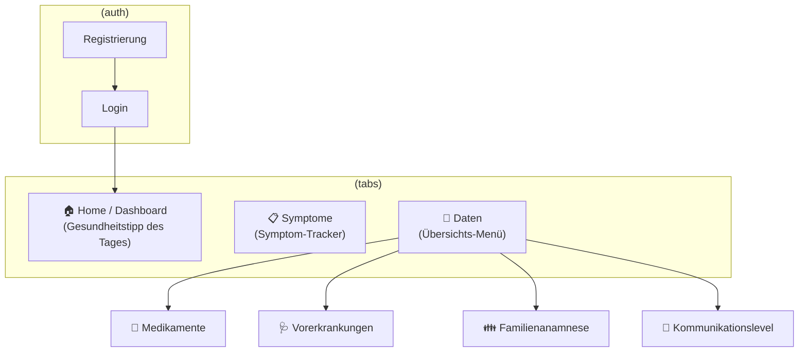

# ADAM – Projektdokumentation

> **Innovationsprojekt „Fehldiagnosen"** · Teamprojekt (5 Personen)
> ADAM ist ein Tool zur Verwaltung medizinischer Daten. Patient:innen pflegen ihre
> Symptome, Medikamente, Vorerkrankungen und Familienanamnese; eine KI erklärt
> Diagnosen verständlich – abgestimmt auf das individuelle Vorwissen (Kommunikationslevel).
> Ziel ist es, Informationslücken zwischen Patient:in und Arzt zu schließen und so
> Fehldiagnosen vorzubeugen.

---

## 1. Systemüberblick

ADAM besteht aus drei eigenständigen Bausteinen:

| Baustein | Technologie | Aufgabe |
|----------|-------------|---------|
| **Patienten-App** | React Native + Expo (TypeScript) | Mobile Oberfläche für Patient:innen |
| **Backend-API** | ASP.NET Core (.NET, Clean Architecture) | Geschäftslogik, Persistenz, Auth |
| **KI-Service** | Node.js / Express + LangChain | Verständliche Erklärung von Diagnosen (RAG-Light) |
| **Datenbank** | MySQL (EF Core) | Persistente Speicherung aller Daten |

**Backend-Schichtung (Clean Architecture):**
`Api` (Controller) → `Application` (Services, DTOs, Interfaces) → `Domain` (Entities, Enums) ← `Infrastructure` (EF-Core-Repositories, SignalR-Hub). Die Abhängigkeiten zeigen nach innen auf die `Domain`; Repositories werden über Interfaces (`Application/Repositories`) entkoppelt und per Dependency Injection in `Program.cs` registriert.

---

## 2. Domain Model

Zentrale Entität ist der **Patient**. Alle medizinischen Datensätze hängen über `PatientId` an ihm. Authentifizierung läuft über ASP.NET Identity (`ApplicationUser`), das per `UserId` mit dem Patienten verknüpft ist.

### Entitäten im Überblick

| Entität | Zweck | Wichtige Felder |
|---------|-------|-----------------|
| **Patient** | Stammdatensatz, Aggregat-Wurzel | Name, Geburtsdatum, Gender, CommunicationLevel |
| **ApplicationUser** | Identity-Login (JWT) | von `IdentityUser` abgeleitet |
| **PatientSymptom** | Tägliche Beschwerden | Intensität (1–10), Dauer, Trigger, freie `Details` |
| **SymptomDefinition / SymptomField** | Vorlagen + dynamische Felder für Symptomerfassung | Aliases, Feldtyp, Pflichtfeld, Optionen |
| **Medication** | Medikation des Patienten | Dosierung, Häufigkeit, Dauer (→ berechnetes `EndDate`), ATC-Code |
| **MedicalHistoryEntry** | Vorerkrankungen | ICD-10, Diagnose, Jahr, Status, KI-Erklärung |
| **Diagnosis** | Detaillierte Diagnose (Arzt/Patient) | ICD, Schweregrad, Symptome, Befund, Therapie, KI-Erklärung |
| **FamilyHistoryEntry** | Familienanamnese | Verwandtschaftsgrad, Diagnose, Kommentar |
| **MedicalLetter** | Arztbrief (KI-Entwurf + Überarbeitung) | Betreff, Empfänger, Status (Validation/Confirmed) |
| **CommunicationLevel** | Vorwissen-Level steuert KI-Prompt | Name (L1/L2/L3), KiPrompt, Handlungsempfehlung |
| **KnownMedication / AtcDrugMapping / DrugInteraction** | Referenzdaten für Autocomplete & Wechselwirkungsprüfung | ATC-Code, DrugBank-ID, Wechselwirkungsbeschreibung |

### Enums
- **ConditionStatus**: `Chronical`, `Active`, `InRemission`
- **EntryBy**: `Patient`, `Doctor` (wer den Eintrag erfasst hat)
- **Gender**: `Male`, `Female`, `Other`

---

## 3. UI Screens (Patienten-App)

Navigation über Expo Router: ein **Auth-Stack** und ein **Tab-Layout** mit drei Haupt-Tabs; weitere Detailscreens werden per Push geöffnet.

| Screen | Datei | Inhalt |
|--------|-------|--------|
| **Login** | `app/(auth)/login.tsx` | Anmeldung, JWT wird in SecureStore/localStorage abgelegt |
| **Registrierung** | `app/(auth)/register.tsx` | Neues Patientenkonto anlegen |
| **Home / Dashboard** | `app/(tabs)/index.tsx` | Begrüßung + „Gesundheitstipp des Tages" (KI) |
| **Symptom-Tracker** | `app/(tabs)/symptom.tsx` | Symptome nach Datum erfassen/bearbeiten/löschen |
| **Daten** | `app/(tabs)/data.tsx` | Menü zu allen Datenbereichen + Logout |
| **Medikamente** | `app/medications.tsx` | Medikation pflegen, Autocomplete, **Wechselwirkungs-Warnung** |
| **Vorerkrankungen** | `app/medicalhistory.tsx` | Historie, KI-Erklärung einer Vorerkrankung |
| **Familienanamnese** | `app/familyhistory.tsx` | Erbliche Erkrankungen erfassen |
| **Kommunikationslevel** | `app/communicationlevel.tsx` | Fragebogen stellt persönliches Vorwissen-Level ein |

**Wiederverwendbare Bausteine:** Card, DataList, Form-Inputs (Picker, Slider, DatePicker), PrimaryButton, HeaderView, ThemedView/ThemedText (Hell-/Dunkelmodus). Datenzugriff gekapselt in Hooks (`use-symptoms`, `use-medications`, `use-patient` …) und API-Services (`src/api/*`).

---

## 4. Architectural Decision Records (ADRs)

Vollständige Begründungen siehe [`records-architecture-decisions.md`](records-architecture-decisions.md). Zusammenfassung:

| Nr. | Entscheidung | Gewählt | Erwogene Alternativen | Kerngrund |
|-----|--------------|---------|-----------------------|-----------|
| **ADR 01** | Frontend Ärzteansicht | **React** | Vue.js | Vorhandene Kenntnisse, großes Ökosystem, Wiederverwendbarkeit |
| **ADR 02** | Frontend Patientenansicht (Framework) | **React Native + Expo** | React, RN ohne Expo | Cross-Platform, Push, Hardware-Zugriff, Hot Reload |
| **ADR 03** | Patientenansicht als **App** (nicht Website) | **Mobile App** | Website | Niedrige Einstiegsbarriere für ältere Nutzer, Push-Reminder, biometrischer Login |
| **ADR 04** | Backend-Framework | **ASP.NET Core Web API** | Node.js, Spring Boot, PHP, Python | Sicherheit/Compliance, Performance, Typsicherheit, EF Core |
| **ADR 05** | Datenbank | **MySQL** | PostgreSQL, MSSQL | ACID, Zuverlässigkeit, .NET-Integration, Kosten/Hosting |

### Implizite Entscheidungen (im Code sichtbar, noch ohne formales ADR)

Diese Punkte sind in der Umsetzung getroffen worden und sollten ggf. als weitere ADRs ergänzt werden:

- **Eigener KI-Service in Node.js statt im .NET-Backend** – bewusst ausgelagert, weil das LangChain-/LLM-Ökosystem in JS reifer ist (deckt sich mit dem in ADR 04 genannten .NET-Nachteil im KI-Bereich).
- **Abstract-Factory-Muster für LLM-Provider** – Provider-Wechsel (Mistral ↔ OpenAI) über eine einzige Code-Zeile; aktuell Mistral.
- **RAG-Light mit Validator-Pipeline** – ICD-10-Wissensbasis (`AI/knowledge/*.md`) + nachgelagerter Validator-Durchlauf (max. 3 Versuche) für patientengerechte, korrekte Erklärungen.
- **JWT-Authentifizierung über ASP.NET Identity**; Passwort-Policy für die Demo bewusst gelockert.
- **Clean Architecture + Repository-Pattern** mit DI als Backend-Grundstruktur.
- **SignalR** für Echtzeit-Medikamenten-Reminder (`/hubs/medication`).

---

## 5. Reflexion & Team-Entscheidungen

### Arbeitsweise im Team (5 Personen)
- **Striktes Kanban-Board** (GitHub Projects): `Ready → In progress → In review → Done`.
- **Feature-Branch-Workflow** – niemand pusht direkt auf `main`.
- **Pull Requests mit Vier-Augen-Prinzip**: jeder PR wird von einem anderen Teammitglied reviewt und erst nach „Approve" gemmerged.
- Issues werden über `Closes #x` automatisch geschlossen.

Die Git-Historie bestätigt diesen Workflow (durchgängig Feature-Branches + Merge-PRs, z. B. `feature/dosierung-menge-einheit`, `46-medikamentenwechselwirkung`).

### Inhaltliche Reflexion
- **Patient als Aggregat-Wurzel** hat sich bewährt: alle medizinischen Daten hängen klar an einem Patienten, Zugriffsrechte werden zentral über `UserId` geprüft.
- **Trennung KI-Service vom Backend** war richtig – das KI-Modul konnte unabhängig (RAG, Validator, Provider-Wechsel) weiterentwickelt werden.
- **Kommunikationslevel als eigene Entität** ermöglicht es, KI-Erklärungen wirklich an das Vorwissen anzupassen, statt nur einen festen Prompt zu nutzen – Kern des „Fehldiagnosen"-Gedankens (Verständnis auf Augenhöhe).
- **Iterative Weiterentwicklung** sichtbar an Diagnose-Entität: vom einfachen `MedicalHistoryEntry` über String-Status hin zu typisiertem `ConditionStatus`/`EntryBy` und integrierter `AiExplanation` (EF-Migrationen).
- **Dosierung** wurde nachträglich in Menge + Einheit getrennt und mit Validierung/Auto-Befüllung versehen – Beispiel für nutzergetriebene Verfeinerung.

### Offene Punkte / Ausblick
- Ärzteansicht (React-Web, ADR 01) ist konzipiert, aber im Repo noch nicht umgesetzt – aktuell nur die Patienten-App.
- Wechselwirkungs- und Bekannte-Medikamente-Daten basieren auf importierten CSVs (`medicinal-products.csv`, `AlleMedikationenStrukturiert.csv`); Datenpflege/-aktualisierung wäre zu klären.
- Formale ADRs für die unter Abschnitt 4 genannten impliziten Entscheidungen (KI-Service, Provider-Factory, Auth) nachziehen.

---

*Stand: 18.06.2026 · erstellt auf Basis eines vollständigen Code-Screenings (Backend, Frontend, KI-Service, ADRs, Git-Historie).*
